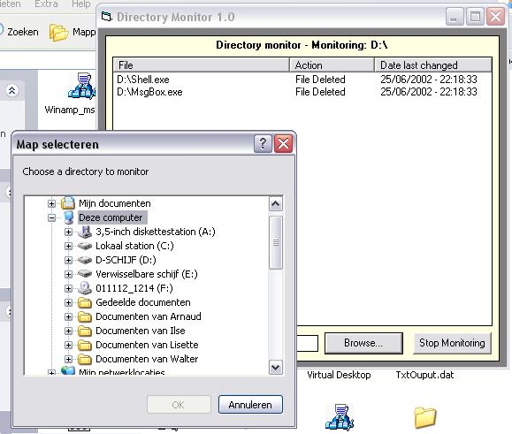



## Directory monitor 1\.0

### Description

Monitors a specified directory for files being created/removed/changed/name changed. Soure code is fully commentend. Any comment/vote (negative of positive) would be greatly appreciated.
 
### More Info
 
a certain directory to modify

Monitors a specified directory for files being created/removed/changed/name changed using the FileSystemObject. This may still contain bugs it's just an example of how you can do this. Any suggestions (negative or positive) would be greatly appreciated.

File changes in a specified directory

When it's reading the files in a directory you can't remove it

             |
---                |---
**Submitted On**   |2002-06-25 22:12:56
**By**             |[Walter Brebels](https://github.com/Planet-Source-Code/PSCIndex/blob/master/ByAuthor/walter-brebels.md)
**Level**          |Intermediate
**User Rating**    |4.3 (17 globes from 4 users)
**Compatibility**  |VB 3\.0, VB 4\.0 \(16\-bit\), VB 4\.0 \(32\-bit\), VB 5\.0, VB 6\.0
**Category**       |[Miscellaneous](https://github.com/Planet-Source-Code/PSCIndex/blob/master/ByCategory/miscellaneous__1-1.md)
**World**          |[Visual Basic](https://github.com/Planet-Source-Code/PSCIndex/blob/master/ByWorld/visual-basic.md)
**Archive File**   |[Directory\_986896252002\.zip](https://github.com/Planet-Source-Code/walter-brebels-directory-monitor-1-0__1-36266/archive/master.zip)

### API Declarations

Some for the dialog box

